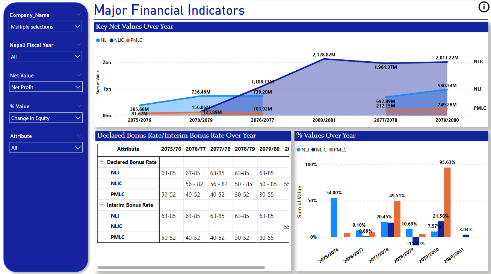
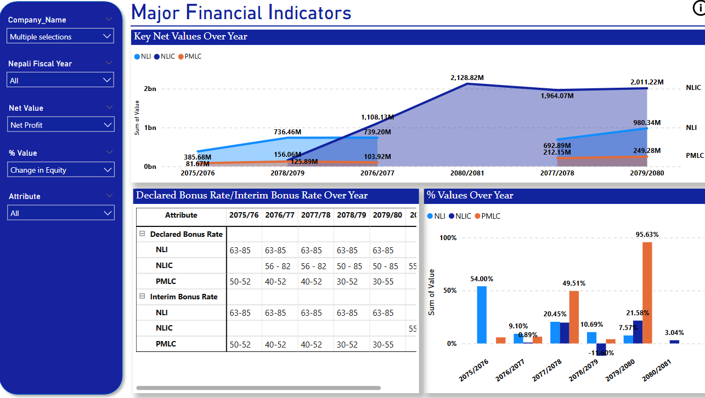
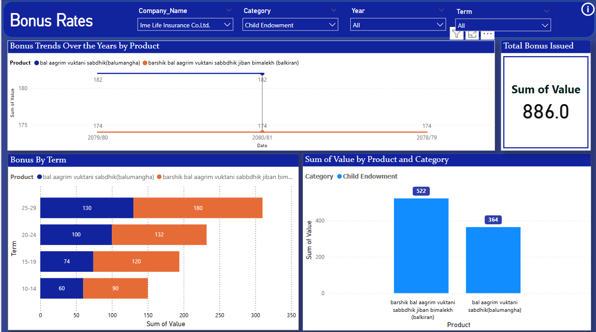

# Nepal-Insurance-Companies-Analysis
This project analyses Nepalese insurance companies using Power BI for visualisation. It aims to uncover industry trends of insurance companies over the past 5 years.

📌 Objectives
- Analyse the major financial indicators and performance of insurance companies. (Past 5 years Data)
- Analyse the Claim Under Different Categories (Past 5 years Data)
- Analyse Gross Earned Premiums (Past 5 years Data)
- Analyse Bonus Rates (Past 5 years Data)
- Analyse the number of Policies  (Past 5 years Data)

Visualise all the above data.

Compare different insurance companies based on various factors.

Identify potential growth opportunities in the Nepalese insurance sector.

🛠️ Tools & Technologies
Power BI – For data visualisation and dashboard creation.

Excel/CSV – Data collection and preprocessing.

📂 Data Sources
Publicly available reports of insurance companies.

Government and regulatory body datasets.

Market research and surveys.

📈 Visualizations & Insights
Company-wise premium and claim trends.

Market share distribution among life insurance companies.

Growth analysis over time.

🚀 Future Enhancements
Integrating additional datasets for deeper analysis.

Expanding analysis to include non-life insurance companies.

Automating data updates using APIs.
